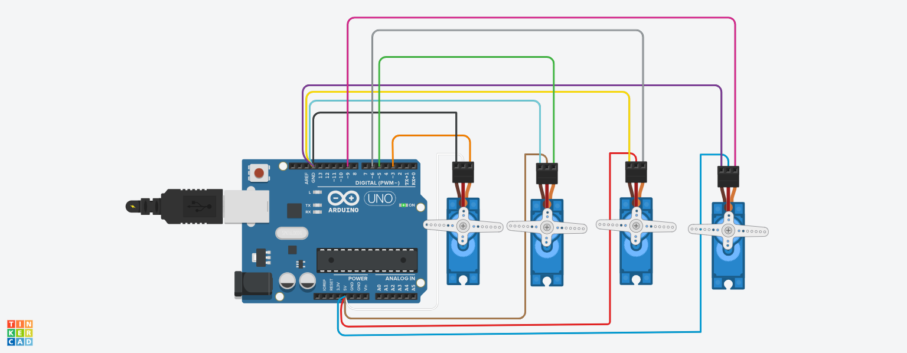
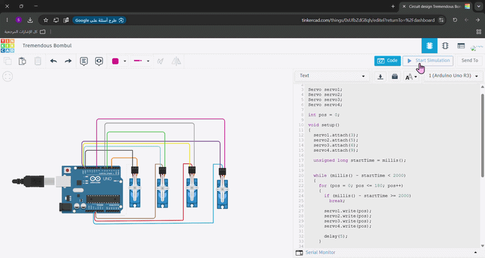

# 🤖 Four Servo Motors Control

An Arduino project that controls four servo motors to perform a synchronized Sweep motion for two seconds, then stop and hold at 90 degrees.

---

## 📌 Project Overview

This project demonstrates how to control four servo motors simultaneously using an Arduino Uno and the Servo library.

At the beginning of the simulation, all four servo motors perform a synchronized Sweep movement for two seconds. After the two seconds are completed, all motors stop and remain fixed at a 90° position.

---

## 🛠 Components Used

- Arduino Uno
- 4 × Servo Motors
- Jumper Wires
- Tinkercad

---

## 💻 Software Used

- Tinkercad Circuits
- Arduino
- Servo Library

---

## 🔌 Circuit Connections

| Servo Motor | Signal Pin |
|-------------|------------|
| Servo 1 | D3 |
| Servo 2 | D5 |
| Servo 3 | D6 |
| Servo 4 | D9 |

### Power Connections

- All servo VCC wires are connected to 5V.
- All servo GND wires are connected to GND.
- Each servo signal wire is connected to a separate digital pin.

---

## ⚙️ How It Works

1. The Arduino connects to the four servo motors.
2. All motors move together using the Sweep movement.
3. The Sweep movement continues for two seconds.
4. After two seconds, all servo motors move to 90°.
5. The motors remain fixed at 90°.

---

## 📂 Repository Contents

```text
Four-Servo-Motors-Control
│
├── Circuit_Design.png
├── Four_Servo_Demonstration.gif
├── Four_Servo_Demonstration.mp4
├── Four_Servo_Sweep.ino
└── README.md
```

---

## 📷 Circuit Design

<p align="center">
  
</p>

---

## 🎥 Project Demonstration

<p align="center">
  
</p>

---

## ✅ Project Result

The four servo motors successfully perform the Sweep movement for two seconds and then stop at a fixed angle of 90°.

---

## 👩🏻‍💻 Author

Sama Alzahrani
